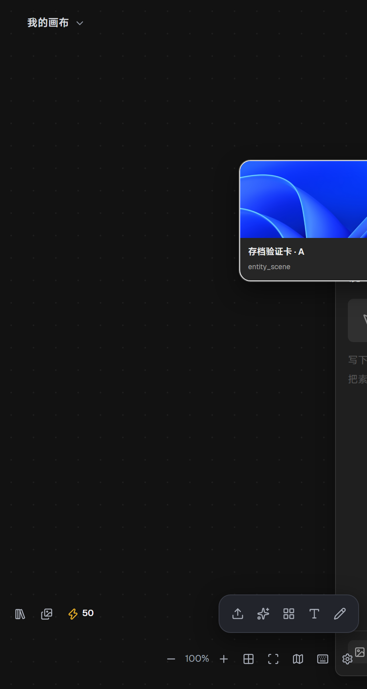
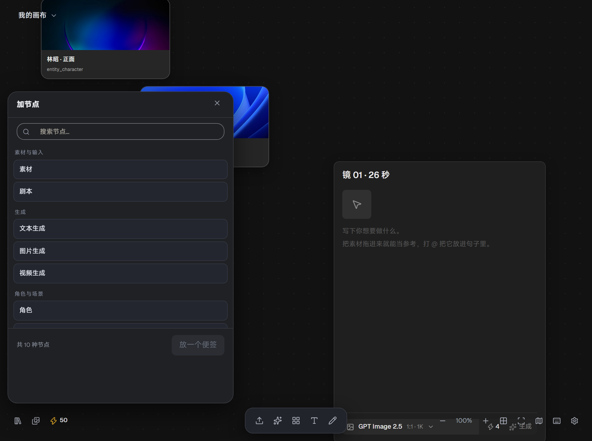
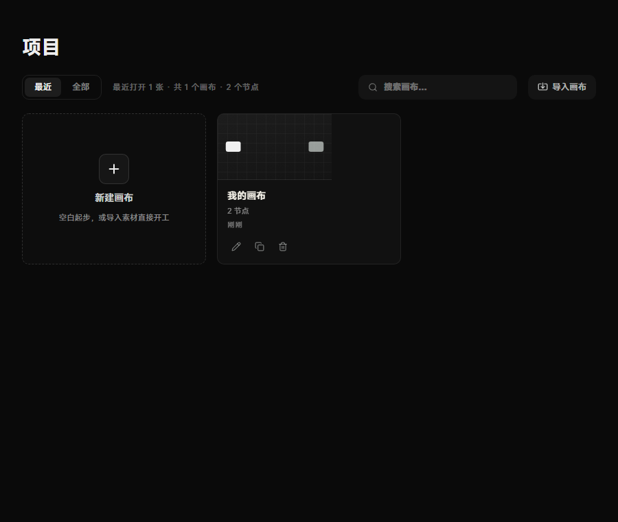

# 无限画布（dsh-infinite-canvas）

把 [NexusVault](https://cnb.cool/hjqn/ai-tansuobianjibu) 的无限画布接进 DeepSeek Harness
的**右侧栏**，并让**对话直接操控它**。

画布落在右栏的原生架构里（一个真正的右侧栏 tab 类型，连同引导页入口与 chip 图标），
不是浮层、不是外挂窗口：拖宽、切全屏、切会话保留、每会话独立布局这些行为都跟
「工作区文件 / 新建终端 / 浏览器」一致。

---

## 现在是什么状态

**真画布已经跑起来了。** 不是占位、不是仿制品 —— 是你开源项目里那个画布本身
（上游 `apps/web/src/views/CanvasView.vue` 及其 45 个文件的闭包），逐字照搬上游的
33 份样式级联，只在两处做窄容器布局适配。

| 部分 | 状态 |
|---|---|
| 宿主半：HTTP 面 + 命令桥 + 9 个 Agent 工具 | ✅ 完成，36 项冒烟测试全绿 |
| 浏览器半：右侧栏 tab 注册、iframe 承载、主题跟随、自动开面板 | ✅ 完成 |
| 画布本体 | ✅ **真画布**：节点卡、8 个面板、右键菜单、涂鸦层、色块、小地图、画布项目管理页全部可用 |
| 命令闭环 | ✅ 实测：`add_card` / `select_card` / `open_panel` / `get_canvas` 返回的都是真画布自己的结构 |
| 存档 | ✅ 实测：localStorage 跨浏览器重启存活 |
| 窄容器排版 | ✅ 实测：380~900px 六档零重叠 |
| DSH 内的最终确认 | ⬜ 需重启 DSH（见文末「已验证 / 未验证」） |

P0-A 阶段的占位画布（`board.js` / `board.html`）已删除。它当时的价值是把命令契约
逐条钉死 —— 那 8 条命令与真画布同语义、同字段名、同错误文案，连 `kind → 节点类型`
的投影都照抄，所以换真画布时**命令面、传输层、HTTP 面、工具层一行都没改**。

## 已经实测到什么程度

1. **宿主半（Node，36 项测试）** — 命令语义、长轮询、只交付一次、回执结算、
   超时文案、队列上限、会话限定、路径逃逸、信任栅栏，以及「传输层必须内联在
   入口模块之前」这条关键不变量。`npm test`
2. **真画布渲染（真实无头浏览器）** — 顶栏项目菜单、点阵舞台、节点卡带资产预览图、
   8 个面板、右键菜单、底部三组浮动工具条。
   
3. **命令闭环（真实浏览器 + 真长轮询）** — 派发 `add_card`（含坐标）→ `open_panel`
   → `select_card` → `get_canvas`，返回的 `entity_scene` / `storyboard_shot`
   默认数据直接来自上游节点 schema；`canvasReady: true`、`delivered == answered`。
   
4. **画布项目管理页** — `index.html#/app/projects`，新建 / 导入 / 打开 / 节点计数。
   

**还没验的**（需要重启 DSH 才能看）：DSH 是否接受这个 tab 注册、iframe 会不会
被信任栅栏拦下、DSH 的主题探测准不准。

---


## 怎么用

### 1. 装进 profile（已经装好了）

```powershell
# 改完源码之后同步一次（pnpm 对 file: 目录依赖按路径判定，不会自己发现改动）
powershell -NoProfile -ExecutionPolicy Bypass -File tools/dev-install.ps1 `
  -DshHome C:\Users\Administrator\.dsh -Profile desktop -SkipProjection
```

> **宿主半**（`index.js`、`lib/*.js`）改了要**重启 DSH 进程**；
> **浏览器半**（`client.js`、`lib/embed/*`）改了**刷新窗口**就够。

### 2. 打开画布

右侧栏的引导页上会多一个「画布」入口（和「工作区文件 / 新建终端 / 浏览器」并排）。
点它，或者点右栏 tab 条的添加控件。

### 3. 让对话操控它

直接说人话就行：

> - 「看看画布上有什么」
> - 「在雨夜街口那张卡右边加一张分镜卡」
> - 「把 3 号卡挪到 (900, 200)」
> - 「把画布上的卡片都框进视野」
> - 「打开生成面板」

模型会调 `canvas_ping` / `canvas_get` / `canvas_add_card` / … 这些工具，命令经
长轮询送到活着的那块画布上执行，结果再回执给模型。

**命令到达时画布没开？** 会自动把右栏画布 tab 打开（前提是
`autoOpenPanel: true`，默认开）。这条靠一个哨兵实现：画布没开时每 2.5 秒读一次
`/status`（纯读端点，不会把命令消费掉），发现队列里有新命令就去开面板。

### 第一次打开要看什么

1. **右栏引导页上有没有「画布」入口** —— 没有就是客户端半没挂上（看 DSH 日志里
   有没有 `infinite-canvas`）。
2. **点开后 iframe 里有没有画布** —— 如果出现一条「画布脚本没有回应」的诊断条，
   它会直接把 iframe 文档里的原文摊给你看。最常见的是 403（信任栅栏拦下了
   iframe 导航）。
3. **颜色跟不跟 DSH** —— 主题初值走 URL 参数（`?theme=`），之后靠 postMessage 跟随。

### 手工排查（不用模型）

```bash
# 独立跑一块画布，不依赖 DSH
node tools/preview-server.mjs 8791
# → http://127.0.0.1:8791/

# 从命令行发一条命令，看画布实时变化
curl -s -X POST http://127.0.0.1:8791/api/dsh-canvas/dispatch \
  -H 'content-type: application/json' \
  -d '{"action":"add_card","params":{"kind":"scene","title":"雨夜街口"}}'

# 看桥与浏览器的诊断快照
curl -s http://127.0.0.1:8791/api/dsh-canvas/status
```

在 DSH 里对应的是 `http://127.0.0.1:19387/api/dsh-canvas/status`。

---

## 命令面

9 个 Agent 工具，全部包 `canvas_` 前缀。`kind` 是给模型的 7 值公开枚举，
`type` 是节点类型真源（**读以 `type` 为准，写只能用 `kind`**）。

| 工具 | 画布动作 | 说明 |
|---|---|---|
| `canvas_ping` | `ping` | 连通性探针，由传输层自己回答（画布契约里没有这条） |
| `canvas_get` | `get_canvas` | 读全部卡片、涂鸦、视口、选中、面板。**改之前先调它** |
| `canvas_add_card` | `add_card` | 建卡，返回 id |
| `canvas_move_card` | `move_card` | 移动到世界坐标 |
| `canvas_delete_card` | `delete_card` | 删除（破坏性，先 `get` 确认） |
| `canvas_select_card` | `select_card` | 选中，用户能看到选中框 |
| `canvas_set_view` | `set_view` | 缩放 / 平移 / `fit` |
| `canvas_open_panel` | `open_panel` | 打开 8 个面板之一 |
| `canvas_run_agent` | `run_agent` | 交给画布自己的助手（**目前是关键词占位**） |

`kind` → `type` 的投影：

```
scene → entity_scene      character → entity_character   note → note
text  → gen_text          board     → storyboard_shot     video → gen_video
audio → asset_input（并写入 data.media_type = 'audio'）
```

---

## 架构

```
对话（模型）
   │  canvas_* 工具
   ▼
宿主半  index.js + lib/{routes,embed,bridge,tools,protocol,config}.js
   │      · /api/dsh-canvas/*   ← 同源 HTTP 面，先过浏览器信任栅栏
   │      · 命令长轮询 GET /next?cursor=N&sessionId=S
   │      · 回执        POST /result
   ▼
传输层  lib/embed/canvas-transport.js   ← 唯一认识 DSH 的前端代码
   │      把 window.nexusvaultMcp 架在长轮询上，自启并从 ?sessionId= 取会话
   ▼
真画布    lib/embed/index.html            ← Poiesis 的画布页（构建产物）
         lib/embed/assets/               Vue Flow + MiSans 分包 + 那 952KB 样式表
         上游 apps/web/src/views/CanvasView.vue 及其 45 个文件的闭包
```

几个刻意的选择：

- **正文是 iframe。** 画布是 Vue 3 + Vue Flow，插件是 React + 无构建；塞进同一
  文档树要处理样式污染和两套响应式共存，而没有一条收益。iframe 换来样式隔离、
  同源（由宿主半发出来，localStorage 有稳定 origin）、尺寸自适应免费。
  DSH 自带的浏览器 tab 用的也是 iframe，所以这不是绕开框架。
  **正因为在 iframe 里，那 33 份全局 CSS 不会外泄** —— 于是可以整条照搬上游级联，
  观感才与开源项目逐字一致（见下）。
- **长轮询而不是 SSE。** `webServer` 交给我们的是裸 `req`/`res`，长轮询零假设就能跑；
  SSE 要求响应不被任何中间层缓冲，没验过。命令闭环不依赖传输方式，以后要换不影响上层。
- **命令只交付一次。** 取走即 `splice`。画布命令不幂等（`add_card` 重投会多出一张卡），
  交付后浏览器崩了就走超时，不重投。
- **画布侧零改动。** 上游 `CanvasView.vue` 挂载时自己会调
  `window.nexusvaultMcp?.onCommand(...)`（它在文件顶部 `declare global` 声明了这个接口），
  我们只是抢先把那个名字占住。8 条命令、kind/面板 id、缩放上下限全部沿用上游常量，
  `lib/protocol.js` 与 `lib/embed/canvas-commands.js` 是它的镜像，改契约时对着改。
- **纯逻辑与 DOM 分离。** `canvas-commands.js` 不碰 DOM，所以那 8 条命令能在单测里
  逐条钉死 —— 这也是上游把 `canvas-commands.ts` 抽出来的同一个理由。它现在**不参与
  运行**，只作为契约镜像给 `smoke-test.mjs` 用；真画布跑的是上游自己那份。

## 真画布是怎么搬进来的

`build/` 是一个独立的构建工程，把上游 `apps/web` 里画布的最小闭包单独打成
一个可静态托管的页面。

```
build/
  tools/sync-upstream.mjs   从上游镜像 116 个文件到 build/src/（含 11 处路径改写）
  tools/copy-static.mjs     搬 5.9MB 演示图（同名同大小则跳过）
  tools/install-embed.mjs   dist/ → lib/embed/，只覆盖产物，手写文件原地保留
  overlay/src/              ← 唯一「我们写的代码」：router / main / library-assets / 壳层
  src/                      上游镜像，每次 sync 清空重建，不要直接改
```

上游路径默认 `_recon/cnb-repo/apps/web`，可 `--from=` 或 `CANVAS_UPSTREAM=` 覆盖。
`npm run build` = sync → copy-static → vite build → install-embed，全套约 25 秒。

三个必须改写的地方（都由 `sync-upstream.mjs` 自动做）：

| 上游写法 | 为什么不行 | 改成 |
| --- | --- | --- |
| `url('/fonts/geist-*.woff2')` | 页面挂在 `/api/dsh-canvas/embed/`，站点根 404 | `url('../fonts/…')`，交给 Vite 当资源处理 |
| `'/library-assets/01_医院大厅_正式.png'` | 同上 | `'library-assets/…'`（相对当前文档） |
| `url('/fonts/wenyuan-rounded-*.woff2')` | 两个各 6.5MB，而该字体上游已退役**且零引用** | 空 data URI |

闭包边界是实测出来的：`canvas/` 45 个文件，外部包只有 6 个真依赖
（`vue` `vue-router` `@vue-flow/{core,background,minimap}` `@lucide/vue`），
**零次网络请求**（全部状态在 localStorage）。所以 pixi / spine / vtable / motion /
react / pinia / element-plus 整棵树都不在产物里。

### 两处必须知道的坑

1. **构建目标要定到能实测的浏览器版本。** 产物里 `@media (max-width: 680px)` 被压缩器
   按 `target: 'chrome122'` 改写成范围语法 `@media (width<=680px)`，而范围语法要
   Chromium 104+。本机无头 Edge 是 **Chromium 100**，整条媒体查询被解析成 `not all`
   永不匹配 —— 布局覆盖全部失效，而页面看起来「只是有点挤」。所以 `build.target`
   定 `chrome100`（DSH 是 Chromium 132，只会更新不会更旧）。
2. **窄容器要把三组工具条折成两行。** 上游把 `.ref-bottom-left` / `.ref-create-bar` /
   `.ref-bottom-right` 排在同一 `bottom: 14px`，内容净宽 116+190+275=581px，
   **视口窄于约 738px 必然重叠**；空态引导的 `.canvas-empty-guide` 是
   `position:absolute; left:50%` 且没给 right 的 shrink-to-fit 陷阱，可用宽度被算成
   视口的一半，按钮被压到 65px、中文逐字换行。两处都由 `overlay/src/dsh-shell.css`
   在 ≤760px 时改布局（不改视觉），实测 380 / 440 / 520 / 700 / 760 / 900 六档零重叠。

## 目录

```
index.js                     宿主半入口
client.js                    浏览器半：右侧栏 tab 注册
cordis.patch.yml             只插入本插件自己的 loader 行
icon.svg / locale/           图标与词典
build/                       真画布的构建工程（见上）
lib/
  config.js                  配置模式（超时、轮询挂起、队列上限、自动开面板）
  bridge.js                  命令桥：排队、只交付一次、结算、超时、会话限定
  routes.js                  /api/dsh-canvas/* HTTP 面
  embed.js                   embed 静态托管（同源 + 路径逃逸防护）
  tools.js                   9 个 Agent 工具
  protocol.js                与真画布对齐的契约常量（附真源指针）
  embed/
    canvas-transport.js      DSH 长轮询 ⇄ window.nexusvaultMcp（构建时被内联进 index.html）
    canvas-commands.js       契约镜像：状态模型 + 8 条命令分发（只给单测用）
    index.html               真画布页（构建产物）
    assets/                  JS / CSS / 字体分包
    library-assets/          资产库演示图
tools/
  smoke-test.mjs             36 项冒烟测试（Node 里跑完整链路）
  preview-server.mjs         独立预览（不依赖 DSH）
  dev-install.ps1            同步进某个 profile
  sync-all.ps1               同步进所有相关 profile
docs/接入方案.md             完整的接入方案与决策依据
docs/验证-*.png              实测截图
```

---

## 下一步

- **P2** 画布项目管理：**已经能用** —— 真画布自带 `CanvasProjectsView`
  （`index.html#/app/projects`，顶栏「我的画布」菜单进入），但还没有从 DSH 侧直达的入口。
- **P3** `run_agent` 从关键词占位升级为「读画布上下文 → 生成结构化 Patch → 应用」；
- **P4** 跨会话的画布项目总览放资料库；
- **P5** 按会话 `cwd` 隔离画布项目存档（现在所有会话共用一份 localStorage）。

## 已验证 / 未验证

已实测（无头 Chromium 100 + 独立预览服务，见 `docs/接入方案.md` §P1）：

- 真画布完整渲染：顶栏项目菜单、点阵舞台、节点卡、8 个面板、右键菜单、底部三组工具条；
- 命令闭环：`add_card` ×3 / `select_card` / `open_panel` / `get_canvas` 全部返回真画布
  自己的结构（`entity_scene`、`storyboard_shot` 的默认数据都来自上游节点 schema）；
- 传输层自启、`canvasReady: true`、`delivered/answered` 计数一致；
- localStorage 存档跨浏览器重启存活；
- 六档视口宽度零重叠；
- 36/36 冒烟测试通过。

**尚未验证：需要重启 DSH 后确认。** tab 注册是否被接受、iframe 导航是否被信任栅栏
拦下（导航请求不带自定义请求头）、主题检测是否准确。

## 许可

MIT
