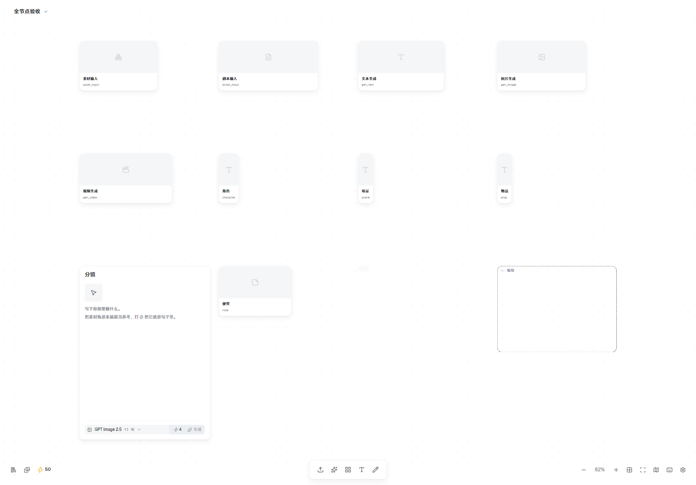
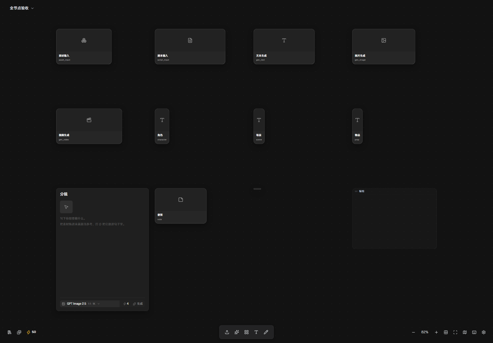

# 无限画布 · DSH 插件

把 [NexusVault](https://cnb.cool/hjqn/ai-tansuobianjibu) 的无限画布接进 **DeepSeek Harness 的右侧栏**，
并让**对话直接操控它**。

画布落在右栏的**原生架构**里 —— 一个真正的右侧栏 tab 类型，连同引导页入口与 chip 图标。
不是浮层，也不是外挂窗口：拖宽、切全屏、切会话保留、每会话独立布局，这些行为都跟
「工作区文件 / 新建终端 / 浏览器」完全一致。



---

## 目录

- [它是什么](#它是什么)
- [已经做到什么](#已经做到什么)
- [怎么用对话操控](#怎么用对话操控)
- [安装](#安装)
- [命令面](#命令面)
- [架构](#架构)
- [主题与外观](#主题与外观)
- [真画布是怎么搬进来的](#真画布是怎么搬进来的)
- [仓库结构](#仓库结构)
- [开发](#开发)
- [已验证 / 未验证](#已验证--未验证)

---

## 它是什么

DSH 的对话里多出 9 个 `canvas_*` 工具。你用人话下指令，模型调工具，命令经长轮询
送到**活着的那块画布**上执行，结果再回执给模型 —— 画布是真画布，不是仿制品。

关键在于**画布侧零改动**：上游 `CanvasView.vue` 挂载时会自己调
`window.nexusvaultMcp?.onCommand(...)`（它在文件顶部 `declare global` 里声明了这个接口），
我们只是抢先把那个名字占住。8 条命令、`kind` 枚举、面板 id、缩放上下限全部沿用上游
常量，所以命令面、传输层、HTTP 面、工具层在换真画布时**一行都没改**。

## 已经做到什么

| 部分 | 状态 |
|---|---|
| 宿主半：HTTP 面 + 命令桥 + 10 个 Agent 工具 | ✅ 完成，**53 项冒烟测试全绿** |
| 浏览器半：tab 注册、iframe 承载、主题跟随、自动开面板 | ✅ 完成 |
| 画布本体 | ✅ **真画布**：节点卡、8 个面板、右键菜单、涂鸦层、色块、小地图、项目管理页全部可用 |
| 命令闭环 | ✅ 实测：`add_card` / `select_card` / `open_panel` / `get_canvas` 返回的都是真画布自己的结构 |
| 主题三态 | ✅ 跟随 DSH 的 `light` / `dark` / `system`，控件外观按 DSH 官方设计 token 重置 |
| 存档 | ✅ 实测：localStorage 跨浏览器重启存活 |
| 窄容器排版 | ✅ 实测：380~900px 六档零重叠 |

## 怎么用对话操控

直接说人话：

> - 看看画布上有什么
> - 在雨夜街口那张卡右边加一张分镜卡
> - 把 3 号卡挪到 (900, 200)
> - 把画布上的卡片都框进视野
> - 打开生成面板

**命令到达时画布没开？** 会自动把右栏画布 tab 打开（`autoOpenPanel: true`，默认开）。

这条靠一个哨兵实现：画布没开时它向 `/status` 发一个**挂起式**请求 —— 没有命令就一直挂在
服务端，命令一产生立刻返回，哨兵随即去开面板。请求次数反而更少（每分钟 3 次，而不是原来定时
轮询的 24 次），更重要的是**命令到达的延迟从「平均白等 1.25 秒」降到一次往返** —— 那 1.25 秒
是冷路径里最贵也最没必要的一块（详见下面的「冷路径」一节）。`/status` 是纯读端点，不会把命令
消费掉，所以"看一眼"和"取走"仍然是两件事。

服务端为什么知道"这条命令你处理过了"：哨兵每次带 `since=<已知的 seq>`，只有出现更新的命令时
服务端才回答。少了这个游标，"立刻回答 + 立刻再问"会打成热循环。

## 安装

> [!IMPORTANT]
> 画布本体（以及它的构建产物）**不在本仓库里**。上游源码是 NexusVault，本仓库只含
> 适配层与构建脚本，所以 clone 之后**必须先构建一次**，否则 `lib/embed/index.html`
> 不存在，画布打不开。

**前置：** 已安装 DSH，Node 22+。

```bash
# 1. 克隆本仓库
git clone https://github.com/Hnqhj/dsh-infinite-canvas.git
cd dsh-infinite-canvas

# 2. 取上游源码到脚本默认找的位置（构建从这里读画布本体）
#    上游仓库：https://cnb.cool/hjqn/ai-tansuobianjibu
git clone https://cnb.cool/hjqn/ai-tansuobianjibu.git _recon/cnb-repo

# 3. 构建画布（约 25 秒，产出 lib/embed/）
cd build && npm install && npm run build && cd ..
```

```powershell
# 4. 同步进 DSH 的某个 profile
powershell -NoProfile -ExecutionPolicy Bypass -File tools/dev-install.ps1 `
  -DshHome "$env:USERPROFILE\.dsh" -Profile desktop -SkipProjection

# 5. 重启 DSH
```

上游位置不在默认路径时，用 `--from=` 参数或 `CANVAS_UPSTREAM=` 环境变量覆盖。

> **改完源码要重新同步**：pnpm 对 `file:` 目录依赖按**路径**而非内容哈希判定，
> 不会发现工作区里的改动。改了就再跑一次第 4 步。
>
> - **宿主半**（`index.js`、`lib/*.js`）改了 → **重启 DSH**
> - **浏览器半**（`client.js`、`lib/embed/*`）改了 → **刷新窗口**即可

**第一次打开看三件事：**

1. 右栏引导页上有没有「画布」入口 —— 没有的话先问 `/status` 的 `host` 字段：`host.web` / `host.tools.registered` 会直接说出是**哪一半**没挂上（`host.webError` 是注册失败的原因）。两半互相看不见，看错方向就白查；DSH 日志里搜 `infinite-canvas` 是同一个答案的另一处来源。
2. 点开后 iframe 里有没有画布 —— 出问题时诊断条会自己出来，它有三种：「画布脚本没有回应」摊开 iframe 原文（最常见是 403：信任栅栏拦下了 iframe 导航）、「画布脚本失去了响应」说明线路通但画布把处理器注销了、「画布连不上命令通道」最后一次故障原文就在下面。每种都附一行传输层自己的计数。
3. 颜色跟不跟 DSH —— 主题初值走 URL 参数 `?theme=`，之后靠 postMessage 跟随

**手工排查（不经过模型）：**

```bash
node tools/preview-server.mjs 8791     # 独立跑一块画布 → http://127.0.0.1:8791/

# 从命令行发一条命令，看画布实时变化
curl -s -X POST http://127.0.0.1:8791/api/dsh-canvas/dispatch \
  -H 'content-type: application/json' \
  -d '{"action":"add_card","params":{"kind":"scene","title":"雨夜街口"}}'

curl -s http://127.0.0.1:8791/api/dsh-canvas/status   # 桥与浏览器的诊断快照
```

在 DSH 里对应 `http://127.0.0.1:19387/api/dsh-canvas/status`。

`/status` 还能**挂起**：带上 `?hold=1&since=<已知的 seq>` 之后，没有新命令它就一直不回答。
浏览器半的哨兵正是这样等命令的。不带 `hold` 就是一次普通的快照读取。

## 命令面

12 个 Agent 工具，全部带 `canvas_` 前缀。`kind` 是给模型的 **7 值公开枚举**，
`type` 是节点类型真源 —— **读以 `type` 为准**；建卡只能用 `kind`，**换类型用 `type`**。

| 工具 | 画布动作 | 说明 |
|---|---|---|
| `canvas_ping` | `ping` | 连通性探针，由传输层自己回答（画布契约里没有这条） |
| `canvas_get` | `get_canvas` | 读全部卡片、涂鸦、视口、选中、面板。**改之前先调它** |
| `canvas_add_card` | `add_card` | 建卡，返回 id。**坐标要么两个都给、要么都不给** —— 只给一个时真画布会把另一个轴置 0 |
| `canvas_update_card` | `update_card` | **往卡片里写内容 / 改标题**（见下）。写入是合并，不是替换 |
| `canvas_set_card_type` | `set_card_type` | **换节点类型**，用于 `kind` 枚举覆盖不到的类型 |
| `canvas_move_card` | `move_card` | 移动到世界坐标 |
| `canvas_delete_card` | `delete_card` | 删除（破坏性，先 `get` 确认） |
| `canvas_select_card` | `select_card` | 选中，用户能看到选中框 |
| `canvas_set_view` | `set_view` | 缩放 / 平移 / `fit` |
| `canvas_open_panel` | `open_panel` | 打开 8 个面板之一 |
| `canvas_batch` | _（多个）_ | 一次调用顺序执行多条命令，失败即停并报出做到了第几步。只在插件侧编排，不新增画布动作 |
| `canvas_run_agent` | `run_agent` | 交给画布自己的助手（**目前是关键词占位**） |

`update_card` / `set_card_type` / `set_card_data` 这三条是**内嵌页专有**的：上游契约里没有它们，
上游桌面端的 MCP 服务也不认。真源在 `build/overlay/src/dsh-commands.ts`。

写内容时 `data` 该给哪些键，取决于卡片类型：

| 类型 | 字段 |
|---|---|
| `storyboard_shot`（分镜，`kind: 'board'`） | `shot_no` / `summary` / `dialogue` / `prompt` / `duration_sec` / `target` / `model_id` / `output_url` / `refs` |
| `entity_character` / `entity_scene` / `entity_prop` | `name` / `description` / `ref_asset_ids` / `preview_url` |
| `note` | `text` |
| `gen_text` | `prompt` / `output` / `model_id` |

`kind` → `type` 的投影：

```
scene → entity_scene      character → entity_character   note → note
text  → gen_text          board     → storyboard_shot     video → gen_video
audio → asset_input（并写入 data.media_type = 'audio'）
```

### 冷路径：超时预算分成两档

「画布已经在那儿等着」和「得先把面板唤醒、再把整个 iframe 拉起来」是两条差一个量级的链路。
共用一份预算，等于让**第一次操作**必输 —— 而且失败之后画布还是被打开了，用户看到的是
「模型说失败了，画布却莫名其妙弹出来了」。

冷路径（画布从未连上过、且开着自动打开）真实要花的时间：

| 环节 | 大约 | 出处 |
|---|---|---|
| 哨兵发现命令 | 一次往返 | client.js 的挂起式 `/status` |
| iframe 冷启动 | 3~5 秒 | 首屏 style 986KB + CanvasView 292KB + Vue 挂载 |
| 等画布注册处理器 | 最多 4 秒 | `canvas-transport.js` 的 `HANDLER_GRACE_MS` |
| 执行 + 回执 | 约 0.3 秒 | 与热路径同 |

所以它用的是另一份预算（默认 **20 秒**，见 `lib/config.js` 的 `coldCommandTimeoutMs`），
热路径仍是 12 秒。判定发生在命令**入队的瞬间**：那一刻画布有没有连过，决定了它配等多久。
开着面板（`autoOpenPanel`）才适用 —— 否则等下去没有意义。

### 模型能改什么、改不了什么

| 能 | 不能 |
|---|---|
| 建卡（种类、标题、坐标） | 卡片之间**连线** —— 上游 2026-09-29 已把端口体系下线，画布里没有 `edges` 这个概念了 |
| **写卡片内容**（场景描述、分镜摘要台词、提示词） | 撤销任何一步 |
| **建完之后改标题** | 把卡片转成 `canvas_text` —— 那是文本工具专有的类型 |
| **换节点类型**（`entity_prop` / `gen_image` / `script_input` …） | 建卡时直接指定 `type` —— 见下 |
| 移动、删除、选中 | |
| 缩放平移、打开面板 | |

#### 写内容这条路是怎么打开的

上游命令面只有 8 个动作，`add_card` 只认 `kind` / `title` / 坐标，所以**模型能摆卡片，却写不进任何
内容** —— 建出来的卡是空的。而画布其实有这些字段（每种类型各带一份 `defaultData`），只是命令面没开。

我们没有去改上游仓库，而是在 `build/overlay/src/dsh-commands.ts` 里**抢在画布注册处理器之前把
`window.nexusvaultMcp.onCommand` 包一层**：认得的动作自己办，不认得的原样转交画布。上游一行没动。

两处关键约束，改这个文件前必须知道：

- **Vue Flow 的 store 只能在组件里拿。** `useVueFlow()` 在组件外调用会 `inject` 不到、于是新建一个
  **空 store**（`@vue-flow/core` 的实现如此）。所以它由 `main.ts` 的根组件在 `setup()` 里调好再传进来 ——
  根组件 `provide` 的那份会被 `CanvasView` `inject` 到，于是我们手里的**就是画布正在用的那份**。
  真机上验证过：`window.__dshExtended.nodeCount()` 与画布上的卡片数一致；不一致就说明这里坏了。
- **改 `build/overlay/**` 之后必须 `npm run build`。** overlay 是覆盖到镜像 `build/src/` 上的，
  不重建就只活在源码里。

#### 为什么没有 `connect`

原计划里列过"卡片之间连线"。**做不了，也不该做**：上游 2026-09-29 已把端口体系整体下线
（`canvas/persistence.ts` 的存档格式里 `edges` 字段直接丢弃，`CanvasView.vue` 全篇零 `addEdges`）。
画布不再是"有向节点图"，而是"素材墙 + 工作板" —— 卡片之间的关系改由**拖进创作板**与
**提示词里 @ 提及**表达，两者都落在 `card.data.refs`。往不存在的结构上加连线，只会写出没人读的数据。

同理，**建卡时指定 `type` 也走不通**：命令层只透传 `kind`，而 `CanvasView` 的
`commandContext.addCard` 又把入参重建成 `{kind, title, x, y}` —— **两道都掐掉了**。
所以换成"先建一张，再 `set_card_type` 转过去"。好在 `CanvasCardNode.vue` 里写着
「节点类型恒为 `canvasCard`，`card.type` 保持唯一真源」，改类型等价于直接建。
另外 **`kind: 'board'` 本来就是分镜卡（`storyboard_shot`）** —— 分镜不用转，容易看漏。

顺带两个实测出来的落位行为，工具层已经挡掉了一半：

- **只给 `x` 或只给 `y` 时，真画布会把另一个轴设成 0**（`Yt()` 里 `x??0, y??0`），卡片会跑到画布
  最上面一行。现在 `canvas_add_card` 要求坐标成对，缺一个就直接报错而不是替它猜。
- **都不给时的自动排位只有 3×3=9 格**（`Mt++ % 9`），第十张会绕回与第一张重叠；而且那九个格位是
  围着**视口中心**转的，不是固定坐标。连着建多张卡时请先 `canvas_get` 取一张参照卡，自己往下排。

## 架构

```
对话（模型）
   │  canvas_* 工具
   ▼
宿主半  index.js + lib/{routes,embed,bridge,tools,protocol,config}.js
   │      · /api/dsh-canvas/*   ← 同源 HTTP 面，先过浏览器信任栅栏
   │      · 命令长轮询 GET /next?cursor=N&sessionId=S
   │      · 回执        POST /result
   ▼
传输层  lib/embed/canvas-transport.js   ← 唯一认识 DSH 的前端代码
   │      把 window.nexusvaultMcp 架在长轮询上，自启并从 ?sessionId= 取会话
   ▼
真画布    lib/embed/index.html            ← NexusVault 的画布页（构建产物）
         lib/embed/assets/               Vue Flow + MiSans 分包 + 样式表
         上游 apps/web/src/views/CanvasView.vue 及其 45 个文件的闭包
```

几个刻意的选择：

- **正文是 iframe。** 画布是 Vue 3 + Vue Flow，插件侧无构建；塞进同一文档树要处理样式
  污染和两套响应式共存，而没有一条收益。iframe 换来样式隔离、同源（由宿主半发出来，
  localStorage 有稳定 origin）、尺寸自适应免费。DSH 自带的浏览器 tab 也是 iframe，
  所以这不是绕开框架。**正因为在 iframe 里，那 33 份全局 CSS 不会外泄** —— 于是可以
  整条照搬上游级联，观感才与开源项目逐字一致。
- **长轮询而不是 SSE。** `webServer` 交给我们的是裸 `req`/`res`，长轮询零假设就能跑；
  SSE 要求响应不被任何中间层缓冲，没验过。命令闭环不依赖传输方式，以后要换不影响上层。
- **命令只交付一次。** 取走即 `splice`。画布命令不幂等（`add_card` 重投会多出一张卡），
  交付后浏览器崩了就走超时，不重投。
- **纯逻辑与 DOM 分离。** `canvas-commands.js` 不碰 DOM，所以那 8 条命令能在单测里
  逐条钉死 —— 这也是上游把 `canvas-commands.ts` 抽出来的同一个理由。它现在**不参与运行**，
  只作为契约镜像给 `smoke-test.mjs` 用；真画布跑的是上游自己那份。

## 主题与外观

画布跟随 DSH 的 `light` / `dark` / `system` 三态，外观按 DSH 官方设计 token 重置，
而不是自己配一套颜色。

 

做法是**一层覆盖**，不碰上游源码：`build/overlay/src/dsh-shell.css` 挂
`html[data-dsh-theme]` 选择器，把 DSH 的 token 整层搬进来后逐处改写。

几个必须知道的约束：

- **DSH 的 token 是两层的。** `--dsw-static-*` 是字面量，`--dsw-alias-*` 是
  `var(--dsw-static-*)` 的引用。跨界传递**只送 alias 会让 `var()` 断链**，声明被丢弃且
  **静默失效** —— 所以必须整层搬。
- **官方 token 表里没有 radius，也没有 shadow**，也没有 `state-danger`
  （危险态真身是 `state-error-primary`）。缺的自己定，不要去猜官方名字。
- **hover 底色用实心层还是 alpha，取决于它下面有没有实底。** 实底上用 `bg-layer-2`，
  透明容器上只能叠 `interactive-bg-hover` 这类 alpha 色。

### 一条容易漏的连带规则

**每换一处底色，必须连带换掉它的文字色。** 容器一变白，写死的浅色字就直接隐形 ——
它不是一块突兀的深色，是一片「什么都没有」，比深底色更难自查：

- `.panel-search input { color: #fff }` —— 打字才看得到字
- `.generate-model-option.selected { color: #fff }` **且它没有自己的 background** ——
  透出的是后面那张已变白的菜单，选中当前模型时整行消失，只剩一个蓝勾浮着
- `.canvas-text-size { color: #e6e8ee; background: transparent }` —— 自身透明，
  透出的是已变白的工具条底

> 一个元素自己没有底色，不等于它安全 —— 要看它**实际透出的是谁的底**。

### 穷举而不是逐个补

这项工作一度靠截图驱动：打到哪改到哪，改完不知道还剩多少。现在反过来 —— 写脚本把上游
画布 CSS **全量**过一遍再对着覆盖层比（`tools/verify/scan-dark-gap.mjs`）：

| 维度 | 扫哪些属性 | 阈值（相对亮度） | 为什么是这个方向 |
|---|---|---|---|
| 深底色 | `background` / `border*` / `box-shadow` | 不透明且 **< 0.30** | 浅色主题下一坨深色 |
| 浅色文字 | `color` | 不透明且 **> 0.75** | **方向故意相反** —— 白底上直接隐形 |

两条都挂进了 `npm test`：深底色 119 处、浅色文字 63 处，**缺口必须为 0**。

## 真画布是怎么搬进来的

`build/` 是一个独立的构建工程，把上游 `apps/web` 里画布的最小闭包单独打成
一个可静态托管的页面。

```
build/
  tools/sync-upstream.mjs   从上游镜像 116 个文件到 build/src/（含 11 处路径改写）
  tools/copy-static.mjs     搬 5.9MB 演示图（同名同大小则跳过）
  tools/install-embed.mjs   dist/ → lib/embed/，只覆盖产物，手写文件原地保留
  overlay/src/              ← 唯一「我们写的代码」：router / main / library-assets / 壳层
  src/                      上游镜像，每次 sync 清空重建，不要直接改
```

`npm run build` = sync → copy-static → vite build → install-embed。

三个必须改写的地方（都由 `sync-upstream.mjs` 自动做）：

| 上游写法 | 为什么不行 | 改成 |
|---|---|---|
| `url('/fonts/geist-*.woff2')` | 页面挂在 `/api/dsh-canvas/embed/`，站点根 404 | `url('../fonts/…')`，交给 Vite 当资源处理 |
| `'/library-assets/01_医院大厅_正式.png'` | 同上 | `'library-assets/…'`（相对当前文档） |
| `url('/fonts/wenyuan-rounded-*.woff2')` | 两个各 6.5MB，而该字体上游已退役**且零引用** | 空 data URI |

闭包边界是实测出来的：`canvas/` 45 个文件，外部包只有 6 个真依赖
（`vue` `vue-router` `@vue-flow/{core,background,minimap}` `@lucide/vue`），**零次网络请求**
（全部状态在 localStorage）。所以 pixi / spine / vtable / motion / react / pinia /
element-plus 整棵树都不在产物里。

### 两处必须知道的坑

1. **构建目标要定到能实测的浏览器版本。** 产物里 `@media (max-width: 680px)` 被压缩器按
   `target: 'chrome122'` 改写成范围语法 `@media (width<=680px)`，而范围语法要 Chromium 104+。
   本机无头 Edge 是 **Chromium 100**，整条媒体查询被解析成 `not all` 永不匹配 —— 布局覆盖
   全部失效，而页面看起来「只是有点挤」。所以 `build.target` 定 `chrome100`
   （DSH 是 Chromium 132，只会更新不会更旧）。
2. **窄容器要把三组工具条折成两行。** 上游把 `.ref-bottom-left` / `.ref-create-bar` /
   `.ref-bottom-right` 排在同一 `bottom: 14px`，内容净宽 116+190+275=581px，
   **视口窄于约 738px 必然重叠**；空态引导的 `.canvas-empty-guide` 是
   `position:absolute; left:50%` 且没给 right 的 shrink-to-fit 陷阱，可用宽度被算成视口的
   一半，按钮被压到 65px、中文逐字换行。两处都由 `overlay/src/dsh-shell.css` 在 ≤760px 时
   改布局（不改视觉），实测 380 / 440 / 520 / 700 / 760 / 900 六档零重叠。


## 仓库结构

```
index.js                     宿主半入口
client.js                    浏览器半：右侧栏 tab 注册
cordis.patch.yml             只插入本插件自己的 loader 行
icon.svg / locale/           图标与词典
build/                       真画布的构建工程（见上）
lib/
  config.js                  配置模式（超时、轮询挂起、队列上限、自动开面板）
  bridge.js                  命令桥：排队、只交付一次、结算、超时（冷热两档）、会话限定、自检状态
  routes.js                  /api/dsh-canvas/* HTTP 面
  embed.js                   embed 静态托管（同源 + 路径逃逸防护）
  tools.js                   12 个 Agent 工具 + 参数收敛（批量与单命令共用同一份）
  protocol.js                与真画布对齐的契约常量（附真源指针）
  embed/
    canvas-transport.js      DSH 长轮询 ⇄ window.nexusvaultMcp（构建时被内联进 index.html）
    canvas-commands.js       契约镜像：状态模型 + 8 条命令分发（只给单测用）
    index.html               真画布页（构建产物，不入库）
    assets/                  JS / CSS / 字体分包（构建产物，不入库）
    library-assets/          资产库演示图（构建时 copy-static 搬入）
tools/
  smoke-test.mjs             56 项冒烟测试（Node 里跑完整链路，含对构建产物的契约断言）
  preview-server.mjs         独立预览（不依赖 DSH）
  dev-install.ps1            同步进某个 profile
  sync-all.ps1               同步进所有相关 profile
  verify/                    随测试一起跑的两条穷举扫描（覆盖率与卫生），见 smoke-test 的 B10
docs/接入方案.md              完整的接入方案与决策依据
docs/验证-*.png              实测截图
```

## 开发

```bash
npm test                          # 56 项冒烟测试
cd build && npm run build         # 构建画布（sync → copy-static → vite → install-embed）
node tools/preview-server.mjs 8791    # 独立预览，不依赖 DSH
```

改样式请改 `build/overlay/src/`，**不要改 `build/src/`**（上游镜像，每次 sync 清空重建）。

## 已验证 / 未验证

已实测（无头 Chromium + 独立预览服务，细节见 `docs/接入方案.md`）：

- 真画布完整渲染：顶栏项目菜单、点阵舞台、节点卡、8 个面板、右键菜单、底部工具条
- 命令闭环：`add_card` ×3 / `select_card` / `open_panel` / `get_canvas`
  全部返回真画布自己的结构
- 传输层自启、`canvasReady: true`、`delivered/answered` 计数一致
- localStorage 存档跨浏览器重启存活
- 六档视口宽度零重叠
- 主题三态：浅色 / 深色两档全量扫描无残留
- 56/56 冒烟测试通过（E 组直接读 `lib/embed/` 的构建产物；E1/E3/E6/E7 与 D6/G1 都做过变异验证 ——
  改动产物或源码的字符串后，对应断言确实变红，不是"永远绿"的空断言）
- 挂起式哨兵：无命令时挂住、命令到时立刻返回、游标追上后不再忙答（F1）
- 冷/热两档超时：冷路径不按常速超时，关掉自动打开则回到常速（F2 / F3）
- `/status` 的 `host` 字段读到的是宿主半的实时引用，不是快照（F4）
- **扩展命令端到端**（无头浏览器 + 预览服务，走真实的 `/dispatch` 链路）：
  `add_card` 建分镜卡 → `set_card_data` 写摘要台词 → `set_card_type` 换成 `gen_text` →
  `update_card` 改标题 → `get_canvas` 读回，全部落在真画布上；
  `__dshExtended.nodeCount()` 与画布卡片数一致（证明 Vue Flow store 是共用那份）

**尚未做的：**

- `canvas_run_agent` 仍是关键词占位，未接真正的「读画布 → 生成 Patch → 应用」
- 画布项目管理页**能用**（真画布自带，顶栏「我的画布」进入），但没有从 DSH 侧直达的入口
- 跨会话隔离：现在所有会话共用一份 localStorage 存档
- 项目管理页（`#/app/projects`）的卡片未做主题适配
- **上游源码没有锁版本。** `build/tools/sync-upstream.mjs` 默认读 `_recon/cnb-repo` 这个
  克隆的 HEAD，README 的安装步骤也没指定 commit —— 也就是说**重新构建可能产出一块不一样
  的画布**。E 组测试（对构建产物的契约断言）会在合约真的被改坏时报警，但它是事后发现，
  不是事前锁定。要彻底解决得加一份 `build/upstream.lock`（含每个同步文件的 SHA256）。


## 许可

MIT
